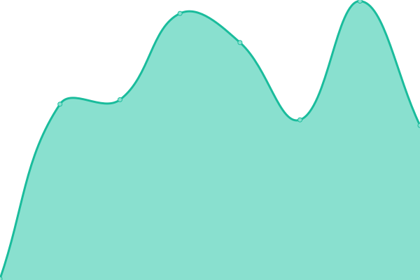
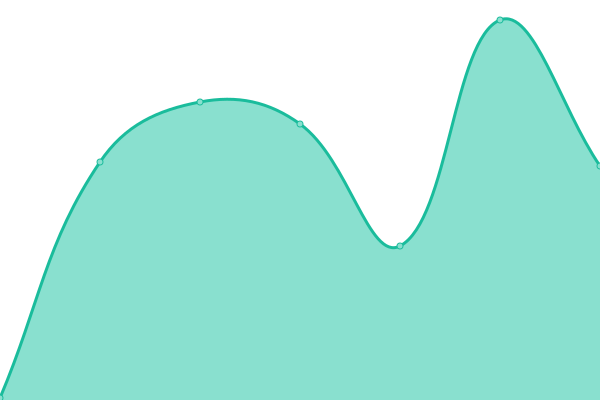
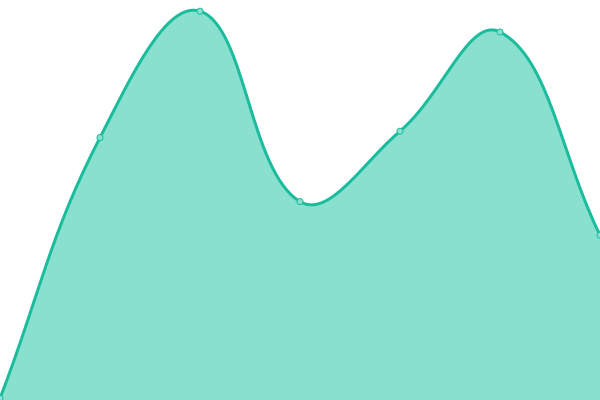
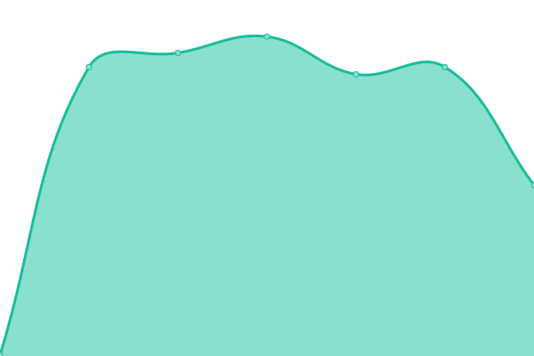

# [📈 Live Status](https://enrique-ibarra.github.io/rh-v2): <!--live status--> **🟧 Partial outage**

This repository contains the open-source uptime monitor and status page for [Enrique Ibarra](https://enrique-ibarra.github.io/rh-v2), powered by [Upptime](https://github.com/upptime/upptime).

With [Upptime](https://upptime.js.org), you can get your own unlimited and free uptime monitor and status page, powered entirely by a GitHub repository. We use [Issues](https://github.com/enrique-ibarra/rh-v2/issues) as incident reports, [Actions](https://github.com/enrique-ibarra/rh-v2/actions) as uptime monitors, and [Pages](https://enrique-ibarra.github.io/rh-v2) for the status page.

<!--start: status pages-->
<!-- This summary is generated by Upptime (https://github.com/upptime/upptime) -->
<!-- Do not edit this manually, your changes will be overwritten -->
<!-- prettier-ignore -->
| URL | Status | History | Response Time | Uptime |
| --- | ------ | ------- | ------------- | ------ |
|  [Web](https://roaminghunger.com) | 🟥 Down | [web.yml](https://github.com/enrique-ibarra/rh-v2/commits/HEAD/history/web.yml) | 

 109ms
     
 | 

<a href="https://enrique-ibarra.github.io/rh-v2/history/web">100.00%</a>
    

|  [Catering](https://catering.roaminghunger.com) | 🟥 Down | [catering.yml](https://github.com/enrique-ibarra/rh-v2/commits/HEAD/history/catering.yml) | 

 104ms
     
 | 

<a href="https://enrique-ibarra.github.io/rh-v2/history/catering">100.00%</a>
    

|  [Kitchen](https://kitchen.roaminghunger.com) | 🟥 Down | [kitchen.yml](https://github.com/enrique-ibarra/rh-v2/commits/HEAD/history/kitchen.yml) | 

 85ms
     
 | 

<a href="https://enrique-ibarra.github.io/rh-v2/history/kitchen">100.00%</a>
    

|  [Vendor](https://vendor.roaminghunger.com) | 🟥 Down | [vendor.yml](https://github.com/enrique-ibarra/rh-v2/commits/HEAD/history/vendor.yml) | 

 72ms
     
 | 

<a href="https://enrique-ibarra.github.io/rh-v2/history/vendor">100.00%</a>
    

|  [Mandrill](https://mandrillapp.com) | 🟩 Up | [mandrill.yml](https://github.com/enrique-ibarra/rh-v2/commits/HEAD/history/mandrill.yml) | 

 322ms
     
 | 

<a href="https://enrique-ibarra.github.io/rh-v2/history/mandrill">100.00%</a>
    

<!--end: status pages-->

[**Visit our status website →**](https://enrique-ibarra.github.io/rh-v2)

## 📄 License

- Powered by: [Upptime](https://github.com/upptime/upptime)
- Code: [MIT](./LICENSE) © [Enrique Ibarra](https://enrique-ibarra.github.io/rh-v2)
- Data in the `./history` directory: [Open Database License](https://opendatacommons.org/licenses/odbl/1-0/)
